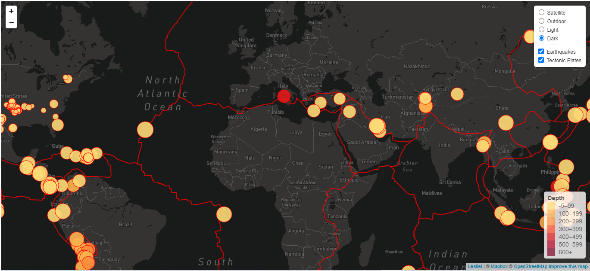

# [<b><u>Geographical Hazards</u></b>](https://raulmaya.github.io/Leaflet-Challenge/Leaflet-Step-2/)
 * Tools: Javascript, Leaflet, D3, JSON, GeoJSON, HTML and CSS

## Sources
* http://earthquake.usgs.gov/earthquakes/feed/v1.0/geojson.php
* https://github.com/fraxen/tectonicplates
* https://leafletjs.com/examples/choropleth/

## Background
The USGS is responsible for providing scientific data about natural hazards, the health of our ecosystems and environment; and the impacts of climate and land-use change. Their scientists develop new methods and tools to supply timely, relevant, and useful information about the Earth and its processes. As a new hire, you will be helping them out with an exciting new project!

The USGS is interested in building a new set of tools that will allow them visualize their earthquake data. They collect a massive amount of data from all over the world each day, but they lack a meaningful way of displaying it. Their hope is that being able to visualize their data will allow them to better educate the public and other government organizations (and hopefully secure more funding..) on issues facing our planet.

## Development
1. Locate earthquake database: [Earthquakes GeoJSON](http://earthquake.usgs.gov/earthquakes/feed/v1.0/geojson.php)

    

2. Locate tectonic plates database : [Tectonic Plates](https://github.com/fraxen/tectonicplates)

    

3. Retrieve both datasets using D3.GeoJSON

    

4. Import and Visualize Data

Create a map using Leaflet that plots all of the earthquakes from your data set based on their longitude and latitude. Showing the relationship between tectonic plates and seismic activity.

  - Satellite View

  

  - Outdoor View

  

  - Light View

  

  - Dark View

  

- - -

### <u>Contact</u>
* Name: Raul Maya Salazar
* Phone: +52 833 159 7006
* E-mail: raulmayas20@gmail.com
* GitHub: https://github.com/RaulMaya
* LinkedIn: https://www.linkedin.com/in/raul-maya/
